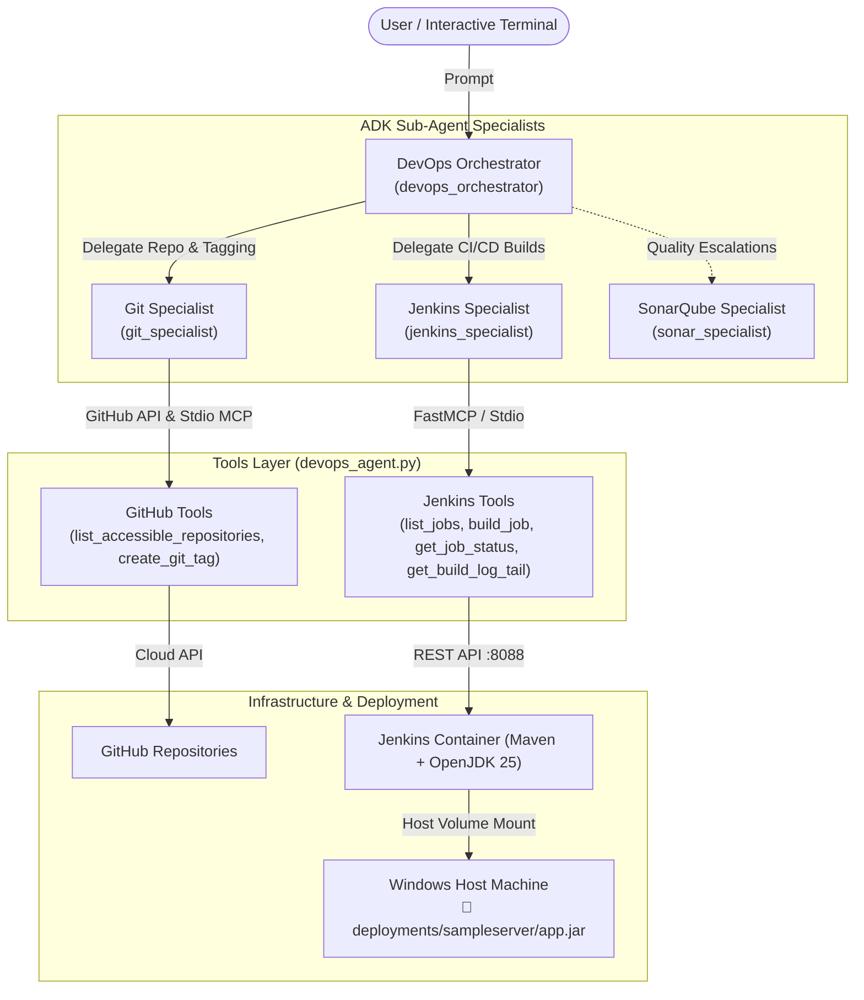

# Multi-Agent DevOps Marketplace (Google ADK + MCP)

[](https://github.com/google/adk)
[](https://modelcontextprotocol.io)
[](https://www.jenkins.io/)
[](https://www.docker.com/)
[](https://www.python.org/)

An enterprise-grade, autonomous multi-agent DevOps engineering marketplace built with **Google ADK (Agent Development Kit)** and native **Model Context Protocol (MCP)** toolsets, coordinating live CI/CD builds on **Jenkins** and direct artifact deployment to the local host machine.

---

## 🏛️ System Architecture



---

## ⚡ Unified Single-File Setup (`devops_agent.py`)

Everything is consolidated into **[devops_agent.py](file:///E:/adk-devops-agent-python/devops_agent.py)** with comprehensive comments and docstrings for every method:

```text
E:\adk-devops-agent-python\
├── devops_agent.py                   # 🌟 ALL-IN-ONE UNIFIED AGENT (Tools + Sub-Agents + Runner)
├── .env                              # Credentials (GEMINI_API_KEY, GITHUB_TOKEN, etc.)
├── .env.example                      # Template configuration
├── requirements.txt                  # Python dependencies
├── deployments/                      # 📁 Deployed Host Artifacts (Mounted from container)
│   └── sampleserver/
│       ├── app.jar                   # Built Spring Boot Executable JAR (~20MB)
│       ├── current_version.txt       # Active deployed release tag
│       ├── deployed_at.txt           # Deployment timestamp
│       └── start.bat                 # Windows double-click launcher
└── docker/
    ├── docker-compose.yml            # Jenkins container with host volume mount
    ├── Dockerfile                    # OpenJDK 25 + Maven 3.9.9 build environment
    ├── create_spring_job.py          # Script creating the Spring Boot Maven pipeline
    └── init-scripts/                 # Jenkins startup security scripts
```

---

## 🚀 Quickstart Guide

### 1. Installation
```powershell
python -m venv .venv
.\.venv\Scripts\Activate.ps1
pip install -r requirements.txt
```

### 2. Configure Environment (`.env`)
```env
GEMINI_API_KEY="your-gemini-api-key"
GITHUB_PERSONAL_ACCESS_TOKEN="ghp_xxxx"
GITHUB_TOKEN="ghp_xxxx"
JENKINS_URL="http://localhost:8088"
JENKINS_USER="admin"
JENKINS_API_TOKEN="admin"
```

### 3. Run the Unified Agent

#### Interactive Shell:
```powershell
.\.venv\Scripts\python.exe devops_agent.py
```

#### Single Query Command:
```powershell
.\.venv\Scripts\python.exe devops_agent.py "List my accessible repositories"
.\.venv\Scripts\python.exe devops_agent.py "Deploy https://github.com/ssJvirtually/sampleserver API with release tag v1.0.4 directly to host machine"
```

#### Google ADK Web UI:
```powershell
.\.venv\Scripts\adk.exe web . --port 8501
```

---

## 🔍 Detailed Code Breakdown in `devops_agent.py`

| Section | Description | Key Methods |
| :--- | :--- | :--- |
| **Section 1: Jenkins Automation** | Manages Jenkins sessions, CSRF crumb tokens, and CI/CD operations | `get_jenkins_session()`, `list_jobs()`, `build_job()`, `get_job_status()`, `get_last_build_status()`, `get_build_log_tail()` |
| **Section 2: GitHub API Tools** | Queries user repository access and manages release tags | `_get_github_headers()`, `list_accessible_repositories()`, `create_git_tag()` |
| **Section 3: FastMCP CLI Hook** | Allows `devops_agent.py` to run as its own FastMCP server via `--mcp-jenkins` | `mcp_app.run()` |
| **Section 4: ADK Toolsets** | Configures `McpToolset` with `StdioConnectionParams` for GitHub and Jenkins | `get_github_toolset()`, `get_jenkins_toolset()` |
| **Section 5: Domain Sub-Agents** | Defines domain specialist LLM agents with focused tool sets | `git_specialist`, `jenkins_specialist`, `sonar_specialist` |
| **Section 6: Root Orchestrator** | Root agent (`devops_orchestrator`) coordinating the multi-step release flow | `root_agent` |
| **Section 7: CLI Runner** | Interactive terminal chat loop and one-liner query executor | `main()` |

---

## 📄 License
This project is open-source under the [MIT License](LICENSE).
