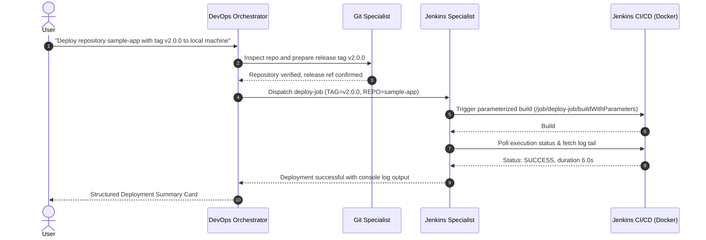

# Multi-Agent DevOps Marketplace (Google ADK + MCP)

[](https://github.com/google/adk)
[](https://modelcontextprotocol.io)
[](https://www.jenkins.io/)
[](https://www.docker.com/)
[](https://www.python.org/)

An enterprise-ready, autonomous multi-agent DevOps engineering marketplace built with **Google ADK (Agent Development Kit)**, native **Model Context Protocol (MCP)** toolsets, and live CI/CD backends (Dockerized **Jenkins**).

---

## 🏛️ System Architecture

```mermaid
flowchart TD
    User([User / ADK Web Console]) -->|Prompt| Orchestrator["DevOps Orchestrator Agent<br/>(devops_orchestrator)"]
    
    subgraph SubAgents["ADK Sub-Agent Specialists"]
        Orchestrator -->|Delegate Repo & Tags| GitAgent["Git Specialist<br/>(git_specialist)"]
        Orchestrator -->|Delegate CI/CD Builds| JenkinsAgent["Jenkins Specialist<br/>(jenkins_specialist)"]
        Orchestrator -.->|Quality Escalations (Standby)| SonarAgent["SonarQube Specialist<br/>(sonar_specialist)"]
    end

    subgraph MCP["MCP Tool Layer (Stdio)"]
        GitAgent -->|Stdio via npx| GitHubMCP["@modelcontextprotocol/server-github"]
        GitAgent -->|GitHub REST API| GitHubAPI["GitHub /user/repos API"]
        JenkinsAgent -->|Stdio FastMCP| JenkinsMCP["mcp_servers/jenkins_server.py"]
    end

    subgraph Infrastructure["DevOps Infrastructure"]
        GitHubMCP -->|Cloud API| GitHubCloud["GitHub Cloud / Enterprise Repos"]
        GitHubAPI -->|Auth Token| GitHubCloud
        JenkinsMCP -->|REST API :8088| JenkinsMaster["Jenkins Container (Docker)<br/>Local Machine Target"]
    end
```

---

## 🔄 End-to-End Deployment Sequence



---

## ✨ Core Features

* 🔍 **Accessible Repository Discovery**: Automatically lists all repositories the authenticated user can access (across owners, collaborators, and organizations) with visibility tags, default branches, and descriptions.
* 🏷️ **Release & Tag Orchestration**: Validates Git SHAs, verifies repository branches, and prepares release tags before triggering deployments.
* ⚙️ **Automated Jenkins CI/CD via FastMCP**: A custom, lightweight FastMCP server connecting to Jenkins REST API supporting:
  * `list_jobs()`: Discover active jobs.
  * `build_job(job_name, params)`: Trigger parameterized builds (`TAG`, `REPO`).
  * `get_job_status(job_name, build_number)`: Poll execution state (`RUNNING`, `SUCCESS`, `FAILURE`).
  * `get_last_build_status(job_name)`: Quick inspection of the latest build.
  * `get_build_log_tail(job_name, build_number, lines)`: Stream trailing console logs.
* 🛑 **Human-in-the-Loop (HITL) Safety Protocol**: If a critical build failure or blocker is detected, execution immediately halts, presenting a structured incident card without performing blind re-triggers.
* 🌐 **Interactive Google ADK Web UI**: Built-in chat interface powered by Google ADK's web server.

---

## 📁 Directory Structure

```text
E:\adk-devops-agent-python\
├── .env.example                      # Environment variables template
├── .gitignore                        # Git ignore patterns (protects secrets)
├── requirements.txt                  # Python dependencies
├── pyproject.toml                    # Package definition
├── docker/
│   ├── docker-compose.yml            # Jenkins LTS JDK17 container (mapped to port 8088)
│   ├── init-scripts/                 # Jenkins init scripts
│   └── setup_jenkins.py              # Automated deploy-job bootstrapper
├── mcp_servers/
│   └── jenkins_server.py             # Standalone FastMCP server wrapping Jenkins REST API
└── marketplace/
    ├── __init__.py                   # Marketplace package root
    ├── agent.py                      # Root Orchestrator (devops_orchestrator)
    ├── connection_configs.py         # Stdio MCP Toolset definitions
    ├── tools/
    │   ├── __init__.py
    │   └── github_tools.py           # User repository access discovery tool
    └── subagents/
        ├── __init__.py
        ├── git_agent.py              # Git Specialist Agent
        ├── jenkins_agent.py          # Jenkins Specialist Agent
        └── sonar_agent.py            # SonarQube Specialist Agent (Standby)
```

---

## 🚀 Getting Started

### 1. Prerequisites
Ensure the following tools are installed on your host machine:
* **Python 3.10+**
* **Docker Desktop** (running)
* **Node.js & npx** (for `@modelcontextprotocol/server-github`)
* **Google Gemini API Key** (from [Google AI Studio](https://aistudio.google.com/))
* **GitHub Personal Access Token** (classic token with `repo` scope)

### 2. Installation
Clone this repository and create a Python virtual environment:
```powershell
git clone https://github.com/ssJvirtually/adk-devops-agent-python.git
cd adk-devops-agent-python

python -m venv .venv
.\.venv\Scripts\Activate.ps1
pip install -r requirements.txt
```

### 3. Environment Configuration
Copy `.env.example` to `.env`:
```powershell
Copy-Item .env.example .env
```
Populate `.env` with your credentials:
```env
# Gemini LLM
GEMINI_API_KEY="your-gemini-api-key"

# GitHub
GITHUB_PERSONAL_ACCESS_TOKEN="ghp_xxxx"
GITHUB_TOKEN="ghp_xxxx"

# Jenkins (Docker Local)
JENKINS_URL="http://localhost:8088"
JENKINS_USER="admin"
JENKINS_API_TOKEN="admin"

# SonarQube (Standby)
SONARQUBE_URL="http://localhost:9000"
SONARQUBE_TOKEN="sqa_xxxx"
```

### 4. Start Jenkins in Docker
Spin up the pre-configured Jenkins container:
```powershell
docker compose -f docker/docker-compose.yml up -d
```
Bootstrap the parameterized `deploy-job`:
```powershell
python docker/setup_jenkins.py
```
> **Jenkins Web UI:** Open [http://localhost:8088](http://localhost:8088) (Default credentials: `admin` / `admin`).

---

## 💻 Running the Agents

### Option A: Google ADK Web Interface (Recommended)
Launch the interactive web console:
```powershell
adk web . --port 8501
```
Open **http://127.0.0.1:8501** in your browser, select the **marketplace** app, and interact with the DevOps Orchestrator.

### Option B: Programmatic Python Runner
```python
import asyncio
from google.adk.runners import Runner
from google.adk.sessions import InMemorySessionService
from google.genai.types import Content, Part
from marketplace.agent import root_agent

async def main():
    session_service = InMemorySessionService()
    session = await session_service.create_session(app_name="marketplace", user_id="user_1")
    runner = Runner(agent=root_agent, app_name="marketplace", session_service=session_service)
    
    prompt = "List all the repositories that I have access to."
    user_msg = Content(role="user", parts=[Part.from_text(text=prompt)])
    
    async for event in runner.run_async(session_id=session.id, user_id="user_1", new_message=user_msg):
        if hasattr(event, "content") and event.content:
            for p in event.content.parts:
                if getattr(p, "text", None):
                    print(p.text)

if __name__ == "__main__":
    asyncio.run(main())
```

---

## 💬 Conversational Prompts

| Intent | Sample Prompt |
| :--- | :--- |
| **Repository Discovery** | *"List all the repositories that I have access to."* |
| **Filtered Search** | *"Show top 5 private repositories where I am an owner or collaborator."* |
| **Inspect Pipelines** | *"List available Jenkins jobs and check the status of deploy-job."* |
| **Deploy Release** | *"Deploy repository sample-app with release tag v2.0.0 to local machine."* |
| **Investigate Logs** | *"Show the console output for the latest build of deploy-job."* |

---

## 🔒 Security & Best Practices

* **No Hardcoded Secrets**: All sensitive API keys and tokens are loaded dynamically from environment variables (`.env`).
* **Git Safe**: Secrets and local data volumes are excluded via `.gitignore`.
* **Process Isolation**: MCP servers communicate over isolated `stdio` pipes on the local host.
* **Escalation Guards**: The orchestrator is explicitly prohibited from retrying on critical failures without human authorization.

---

## 📄 License
This project is open-source under the [MIT License](LICENSE).
